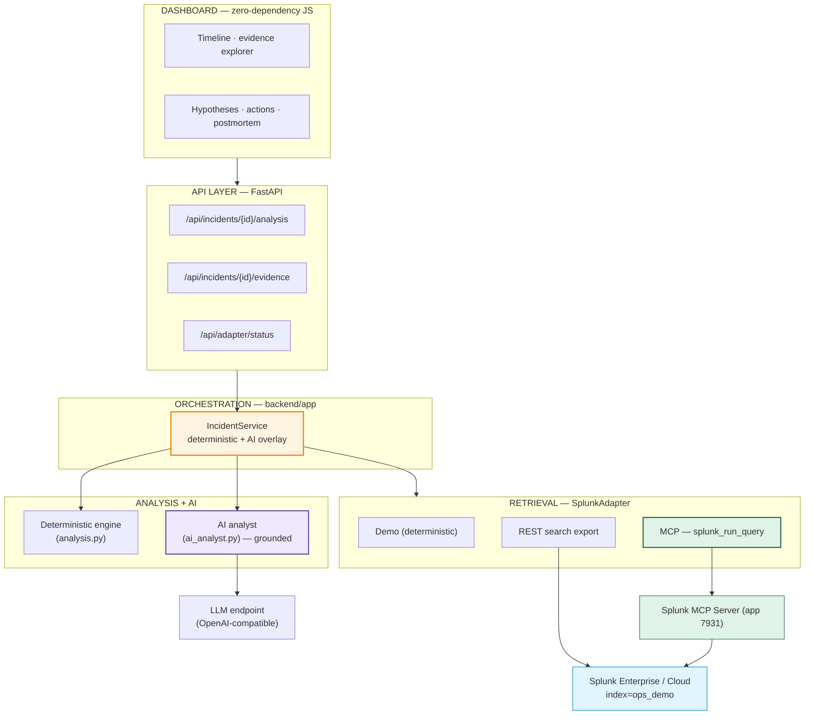
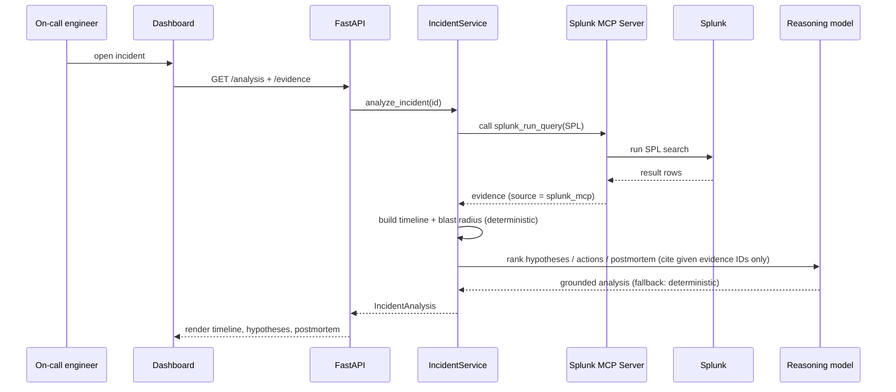

# Ops Flight Recorder — AI Incident Command for Splunk

**Built with:** Python 3.11 · FastAPI · Splunk Enterprise 10.4 · Splunk MCP Server (Model Context Protocol) · pluggable LLM reasoning (OpenAI-compatible) · Pydantic v2 · zero-dependency JS dashboard · uv · MIT licensed

[](https://www.python.org/downloads/)
[](https://fastapi.tiangolo.com/)
[](https://www.splunk.com/)
[](https://splunkbase.splunk.com/app/7931)
[](https://modelcontextprotocol.io/)
[](#verification)
[](https://opensource.org/licenses/MIT)

> **Splunk already has the evidence. Ops Flight Recorder turns it into the answer.**
> When production breaks, it reconstructs the incident — an evidence-backed timeline, AI-ranked root cause, blast radius, recommended actions, and a drafted postmortem — in seconds, with Splunk as the source of truth.

The worst part of an incident isn't the fix — it's the first 30 minutes of *figuring out what happened*. On-call engineers fan out across Splunk running one-off searches: Was there a deploy? Which service? What's the customer impact? The answers are **already in Splunk**, but stitching them into a decision is manual, stressful, and inconsistent.

Ops Flight Recorder is an **agentic incident-command workspace**. Point it at an incident and it pulls the evidence from Splunk through the **Splunk MCP Server**, assembles a chronological reconstruction, and runs an AI agent that ranks root-cause hypotheses (each citing the exact Splunk evidence), quantifies the customer blast radius, recommends prioritized actions, and drafts the postmortem. The model may only cite evidence IDs returned from Splunk, so it **cannot invent facts**.

*Splunk Agentic Ops Hackathon — Observability track. Also targeting **Best Use of Splunk MCP Server**.*

## Quick Highlights

- **An agent over Splunk, not a dashboard** — it retrieves evidence, reasons over it, and produces a decision-ready reconstruction: timeline → ranked hypotheses → blast radius → actions → postmortem.
- **Real Splunk MCP Server integration** — retrieval runs through the official Splunk MCP Server (`splunk_run_query`) over streamable HTTP, verified end-to-end against a live Splunk Enterprise 10.4.
- **Evidence-grounded AI** — every hypothesis, action, and postmortem reference cites a real Splunk evidence ID; the model is structurally prevented from fabricating evidence.
- **Three retrieval modes behind one boundary** — `demo` (deterministic), `real` (REST search), `mcp` (Splunk MCP Server) — the analysis engine, AI layer, and UI never change.
- **Deterministic where it matters** — if the model is unavailable or misconfigured, the analysis falls back to a transparent rule engine, so the API and the demo never break.
- **Provider-pluggable reasoning** — any OpenAI-compatible endpoint (Splunk hosted models supported), selected by one env var, dependency-free (stdlib HTTP).
- **31 tests passing** — `uv run pytest`; the AI and MCP paths are unit-tested with injected fakes (no network, no live model).

## Run Modes at a Glance

| Mode | `OPS_FLIGHT_RECORDER_ADAPTER` | Evidence source | Needs |
|---|---|---|---|
| **Demo** (default) | `demo` | `splunk_demo` | Nothing — runs offline in ~60s |
| **REST** | `real` | `splunk_search` | A running Splunk + admin creds |
| **MCP** | `mcp` | `splunk_mcp` | Splunk + MCP Server app 7931 + token |

AI reasoning is an independent layer (`OPS_FLIGHT_RECORDER_AI`) that overlays on **any** mode; off by default with a deterministic fallback.

## Architecture

### High-Level Workflow

```mermaid
graph LR
    subgraph S1["STEP 1 · AN INCIDENT"]
        INC["Production breaks<br/>(checkout degrades)"] --> SPL["Splunk holds the evidence:<br/>deploys · metrics · logs · KPIs"]
    end
    subgraph S2["STEP 2 · RETRIEVE"]
        SPL --> MCP["Pull evidence via<br/>Splunk MCP Server"]
        MCP --> NORM["Normalize →<br/>IncidentEvent / Evidence"]
    end
    subgraph S3["STEP 3 · REASON"]
        NORM --> TL["Build evidence timeline"]
        TL --> HYP["AI ranks root causes<br/>(grounded in evidence IDs)"]
        HYP --> BR["Quantify blast radius<br/>& customer impact"]
    end
    subgraph S4["STEP 4 · DECIDE + REPORT"]
        BR --> ACT["Recommended actions"]
        ACT --> PM["Postmortem draft"]
        PM --> UICMD["Incident Command UI"]
    end

    style INC fill:#fff4e1,stroke:#f57c00
    style MCP fill:#dff3e8,stroke:#2c6e49
    style HYP fill:#efe7fb,stroke:#6b4fa0
    style UICMD fill:#e1f5ff,stroke:#0288d1
```



### System Architecture



### Tool-Call Sequence



Component responsibilities and the data-flow write-up are in [`architecture_diagram.md`](architecture_diagram.md) at the repo root.

## Tech Stack

| Layer | Technology | Purpose |
|---|---|---|
| **Retrieval** | Splunk MCP Server (app 7931) · Splunk REST search export | Pull incident evidence from Splunk; three adapters behind one `SplunkAdapter` protocol |
| **MCP client** | `mcp` Python SDK over streamable HTTP | Calls `splunk_run_query` at `/services/mcp` with a Bearer token; imported lazily |
| **Reasoning** | Pluggable LLM over an OpenAI-compatible endpoint (Splunk hosted models supported) | Ranked hypotheses, recommended actions, postmortem — evidence-grounded, temperature 0 |
| **Analysis core** | Deterministic Python engine | Timeline, hypothesis scoring, blast radius, actions, postmortem — the demo-safe fallback, fully unit-tested |
| **API** | FastAPI | JSON API serving the analysis and raw evidence |
| **Dashboard** | Zero-dependency HTML/CSS/JS | Incident-command UI served as static files by FastAPI |
| **Contracts** | Pydantic v2 | `IncidentEvent` / `Evidence` / `IncidentAnalysis` at every boundary |
| **Tooling** | uv · pytest · ruff | Reproducible installs; 31 hermetic tests |

## How It Works

### 1. Retrieve — Splunk is the source of truth

Evidence is read from Splunk through a pluggable `SplunkAdapter` (`backend/app/splunk_client.py`). The MCP adapter (`backend/app/splunk_mcp_client.py`) runs the same SPL the REST adapter does, but executes it through the Splunk MCP Server's `splunk_run_query` tool and tags every record `source = splunk_mcp`. Rows normalize into one shared `IncidentEvent` / `Evidence` contract, so nothing downstream knows or cares which mode produced them.

### 2. Reason — AI grounded in evidence IDs

When AI is enabled, `backend/app/ai_analyst.py` hands the model the incident and its evidence and asks for ranked hypotheses, actions, and a postmortem **as JSON that may only reference the evidence IDs provided**. Unknown IDs are dropped, so the model cannot fabricate a citation. If the model is off, unreachable, or returns unusable output, the service silently falls back to the deterministic engine — the analysis API never fails.

### 3. Decide — transparent reconstruction

Every incident becomes: an **investigation plan**, an **evidence-backed timeline**, **ranked root-cause hypotheses** (with confidence + scoring signals + supporting evidence), a **blast-radius** summary (impacted services/regions, customer impact, key metrics), **recommended actions** (prioritized, with owners), and a **postmortem draft**. The deterministic path is a pure function of the evidence; the AI path enriches the language while staying grounded.

## Project Structure

```text
splunk-ops-flight-recorder/
├── architecture_diagram.md     # required architecture diagram (flow + system)
├── LICENSE                     # MIT
├── README.md
├── pyproject.toml              # Python deps + tool config (uv)
├── uv.lock
├── backend/
│   ├── app/
│   │   ├── models.py           # Pydantic contracts (Evidence, IncidentEvent, IncidentAnalysis, ...)
│   │   ├── demo_data.py        # the deterministic demo incident (example dataset)
│   │   ├── splunk_client.py    # SplunkAdapter: demo / REST / MCP + row normalization
│   │   ├── splunk_mcp_client.py# Splunk MCP Server client (streamable HTTP, lazy mcp SDK)
│   │   ├── ai_analyst.py       # evidence-grounded AI reasoning (pluggable provider)
│   │   ├── analysis.py         # deterministic engine (timeline, hypotheses, blast radius, ...)
│   │   ├── incident_service.py # orchestration + AI overlay with deterministic fallback
│   │   └── main.py             # FastAPI routes + static UI serving
│   └── tests/                  # 31 tests (analysis, api, splunk_client, ai_analyst, splunk_mcp, ingest)
├── frontend/                   # incident-command dashboard (index.html · app.js · styles.css)
├── scripts/
│   └── ingest_demo_data.py     # push the demo incident into Splunk (management API)
└── docs/                       # architecture · splunk-mcp (setup guide)
```

## Quick Start

Prerequisites: [`uv`](https://docs.astral.sh/uv/) (manages Python 3.11+). A running Splunk and a model key are **optional** — demo mode needs neither.

### 1. Demo mode — no Splunk, no key, ~60 seconds

```bash
uv sync
uv run pytest                  # 31 passing
uv run uvicorn backend.app.main:app --host 127.0.0.1 --port 8011
```

Open **http://127.0.0.1:8011** — the full workspace renders from deterministic, Splunk-shaped evidence.

### 2. Enable AI reasoning (optional, overlays any mode)

```bash
# Splunk hosted models / any OpenAI-compatible endpoint:
export OPS_FLIGHT_RECORDER_AI=openai
export OPENAI_BASE_URL="<hosted model endpoint>"   # e.g. https://.../v1
export OPENAI_API_KEY="<token>"                    # or SPLUNK_AI_API_KEY
export OPS_FLIGHT_RECORDER_AI_MODEL="<model name>"
```

Analysis then returns `"reasoning": "ai"` and a `reasoning_model`; otherwise it stays `"deterministic"`. On Windows PowerShell use `$env:NAME="value"`.

### 3. Real Splunk via REST

```bash
export OPS_FLIGHT_RECORDER_ADAPTER=real
export SPLUNK_USERNAME=admin SPLUNK_PASSWORD='<pw>'
export SPLUNK_BASE_URL=https://127.0.0.1:8089 SPLUNK_INDEX=ops_demo SPLUNK_VERIFY_SSL=false
uv run python scripts/ingest_demo_data.py --send-management   # creates index + 9 events
uv run uvicorn backend.app.main:app --host 127.0.0.1 --port 8011   # sidebar shows splunk_search
```

### 4. Real Splunk via the MCP Server

Install the **Splunk MCP Server** ([Splunkbase 7931](https://splunkbase.splunk.com/app/7931)), restart Splunk, then:

```bash
TOKEN=$(curl -sk -u admin:'<pw>' \
  "https://127.0.0.1:8089/services/mcp_token?output_mode=json&username=admin&expires_on=%2B30d" \
  | python3 -c "import sys,json;print(json.load(sys.stdin)['token'])")

export OPS_FLIGHT_RECORDER_ADAPTER=mcp SPLUNK_MCP_TOKEN="$TOKEN"
export SPLUNK_BASE_URL=https://127.0.0.1:8089 SPLUNK_INDEX=ops_demo SPLUNK_VERIFY_SSL=false
uv run uvicorn backend.app.main:app --host 127.0.0.1 --port 8011   # sidebar shows splunk_mcp
```

Full MCP setup, the searches, and overrides are in [`docs/splunk-mcp.md`](docs/splunk-mcp.md).

> **Tip:** put any of the above in a git-ignored `.env` and load it with `set -a && source .env && set +a` (or `uvicorn --env-file .env`). Never commit secrets.

## API

| Endpoint | Returns |
|---|---|
| `GET /` | The incident-command dashboard |
| `GET /api/health` | Liveness + adapter mode |
| `GET /api/adapter/status` | Which Splunk source is active (`splunk_demo` / `splunk_search` / `splunk_mcp`) |
| `GET /api/incidents` | Incident summaries |
| `GET /api/incidents/{id}/analysis` | Full reconstruction (plan, timeline, hypotheses, blast radius, actions, postmortem) |
| `GET /api/incidents/{id}/events` | Normalized incident events |
| `GET /api/incidents/{id}/evidence` | Raw Splunk-backed evidence records |

## Verification

```bash
uv run pytest                 # 31 tests, hermetic (no network, no live model)
```

The AI layer is tested with an injected fake client (grounding + fallback), and the MCP adapter with an injected query executor and sample tool-result payloads — so the full pipeline is verified without a live Splunk or model. Useful live checks:

```text
http://127.0.0.1:8011/api/adapter/status
http://127.0.0.1:8011/api/incidents/inc-checkout-payment-2026-06-06/analysis
```

## License

MIT — see [`LICENSE`](LICENSE). Splunk remains the source of truth; Ops Flight Recorder turns its evidence into a decision.
