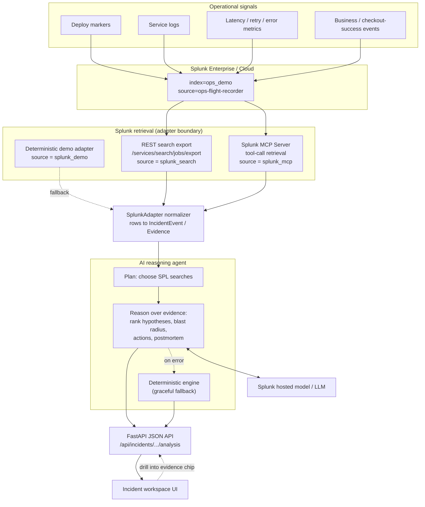

# Architecture Diagram — Ops Flight Recorder

Ops Flight Recorder is an **agentic incident-reconstruction workspace for Splunk**.
It turns Splunk-resident operational data (deploy markers, logs, metrics, and
business-impact events) into an evidence-backed timeline, AI-generated root-cause
hypotheses, a blast-radius summary, recommended actions, and a postmortem draft.

This diagram shows the three things the system depends on:

1. **How the app interacts with Splunk** — retrieval runs through Splunk, via
   either the REST search export API or the **Splunk MCP Server**.
2. **How AI integrates** — an AI reasoning agent consumes the normalized Splunk
   evidence and produces the analysis (hypotheses, actions, postmortem), backed
   by a **Splunk hosted model** (or a pluggable LLM).
3. **The data flow** — from raw Splunk events through normalization, agentic
   reasoning, the JSON API, and finally the workspace UI.

## System Flow

## Component Responsibilities

| Layer | Component | Responsibility |
|---|---|---|
| Data | Splunk index `ops_demo` | System of record for all incident evidence |
| Retrieval | REST / MCP / demo adapters | Pluggable Splunk access behind one `SplunkAdapter` protocol |
| Normalize | `SplunkAdapter` row mapping | Convert search rows into `IncidentEvent` + `Evidence` |
| **AI** | **Reasoning agent + hosted model** | **Plan searches, rank root-cause hypotheses, draft postmortem** |
| Resilience | Deterministic engine | Fallback so the demo never breaks if the model is unavailable |
| API | FastAPI | Serve analysis as JSON |
| UI | Incident workspace | Timeline, hypotheses, blast radius, actions, postmortem, evidence explorer |

## Why the adapter + agent boundaries matter

Splunk access sits behind `SplunkAdapter`, and reasoning sits behind the agent
layer. This means demo mode stays deterministic, REST mode works against local
Splunk today, the **Splunk MCP Server** can be swapped in for retrieval, and the
**AI model** can be swapped (Splunk hosted model or another LLM) — all without
changing the API or UI contract. Splunk remains the source of truth; the agent
turns Splunk evidence into a decision-ready incident reconstruction.
