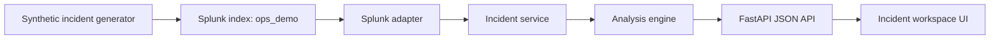

# Architecture

## Product Shape

Ops Flight Recorder is a Splunk-backed incident command workspace. The app is
not a chatbot; it presents a structured reconstruction of an incident:

- incident header and confidence
- investigation plan
- evidence-backed timeline
- ranked root-cause hypotheses
- blast-radius summary
- recommended actions
- evidence explorer
- postmortem draft

## Components



## Backend

The backend is intentionally small:

- `backend/app/models.py`: shared Pydantic contracts
- `backend/app/demo_data.py`: deterministic incident scenario
- `backend/app/splunk_client.py`: demo and real Splunk adapters
- `backend/app/analysis.py`: timeline, hypothesis, blast radius, actions, postmortem
- `backend/app/incident_service.py`: orchestration
- `backend/app/main.py`: FastAPI routes and static UI serving

## Splunk Integration

The real adapter searches local Splunk with:

```text
index=ops_demo source=ops-flight-recorder incident_id=*
```

Rows are normalized into:

- `IncidentSummary`
- `IncidentEvent`
- `Evidence`

The analysis layer does not know whether events came from deterministic demo
data, Splunk REST search, or a future Splunk MCP Server call.

## MCP Strategy

The app currently has a working Splunk REST integration. The MCP integration
point is the `SplunkAdapter` protocol:

```python
class SplunkAdapter(Protocol):
    def list_incidents(self) -> list[IncidentSummary]: ...
    def fetch_incident_events(self, incident_id: str) -> list[IncidentEvent]: ...
    def status(self) -> AdapterStatus: ...
```

A Splunk MCP implementation should:

1. execute equivalent Splunk searches through the MCP server,
2. normalize tool results into `IncidentEvent` records,
3. set evidence source to `splunk_mcp`,
4. preserve the API and UI contracts.

This keeps the demo robust with REST today while making MCP a focused adapter
swap instead of a rewrite.
